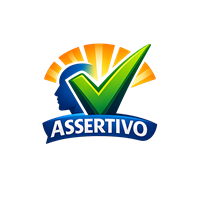

# Assertivo

A fluent, strongly-typed assertion library for .NET with a `.Should()` entry-point pattern, zero-allocation happy paths, and AOT compatibility.

[](LICENSE)
[](https://dotnet.microsoft.com/)




## Installation

```bash
dotnet add package Assertivo
```

## Quickstart

Add the using directive:

```csharp
using Assertivo;
```

Write your first assertion:

```csharp
[Fact]
public void My_first_assertion()
{
    int result = 2 + 2;
    result.Should().Be(4);
}
```

Run your tests:

```bash
dotnet test
```

## Examples

### Boolean assertions

```csharp
bool isReady = true;
isReady.Should().BeTrue();
isReady.Should().NotBe(false);
```

### String assertions

```csharp
string name = "Assertivo";
name.Should().Contain("Assert");
name.Should().NotBeNullOrEmpty();
name.Should().NotContain("secret", "credentials must not be logged");
```

### Numeric assertions

```csharp
int count = 10;
count.Should().BeGreaterThanOrEqualTo(5);
count.Should().BeLessThan(100);
```

### Collection assertions

```csharp
var items = new List<string> { "a", "b", "c" };
items.Should().HaveCount(3);
items.Should().Contain("b");
items.Should().BeEquivalentTo("c", "a", "b"); // order-independent
items.Should().NotBeEmpty();
```

### Drill-down with `.Which`

```csharp
var users = new List<User> { new("Alice") };
users.Should().ContainSingle()
    .Which.Name.Should().Be("Alice");
```

### Exception assertions

```csharp
Action act = () => throw new ArgumentNullException("param");
act.Should().Throw<ArgumentNullException>()
    .Which.ParamName.Should().Be("param");
```

### Async exception assertions

```csharp
Func<Task> act = async () => { await Task.Delay(1); throw new InvalidOperationException(); };
await act.Should().ThrowAsync<InvalidOperationException>();
```

### Custom comparers

```csharp
result.Should().Be(expected, StringComparer.OrdinalIgnoreCase);
items.Should().BeEquivalentTo(expected, myCustomComparer);
```

### `because` reasons

```csharp
logs.Should().NotContain("secret-key", "credentials must not be logged");
```

## Build

### Prerequisites

- [.NET 10 SDK](https://dotnet.microsoft.com/download)

### Restore and build

```bash
dotnet build
```

### Run tests

```bash
dotnet test
```

Tests are run with code coverage (Cobertura format). Coverage output is written to `tests/Assertivo.Tests/TestResults/`.

### Run tests with coverage report

```bash
dotnet test /p:CollectCoverage=true
```

### Build the NuGet package

```bash
dotnet pack src/Assertivo/Assertivo.csproj --configuration Release
```

The `.nupkg` is placed in `src/Assertivo/bin/Release/`.

### Run benchmarks

Benchmarks require a Release build and must be run outside the test runner:

```bash
dotnet run --project tests/Assertivo.Benchmarks --configuration Release
```

Results are written to `BenchmarkDotNet.Artifacts/results/`. The happy-path `Should().Be()` benchmark measures zero heap allocation at ~0.18 ns per call.
